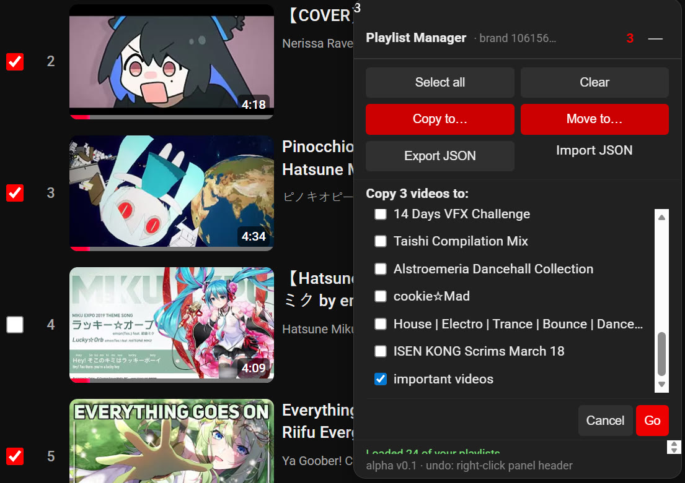

# PlaylistPlus

Free Tampermonkey / Violentmonkey userscript. Bulk copy or move videos across your YouTube playlists using checkboxes. Export and import playlists as JSON. The missing YouTube power-user tool.



## Install

1. Install **Tampermonkey** (Chrome / Firefox / Edge) or **Violentmonkey** if you don't have a userscript manager.
2. Open `PlaylistPlus.user.js` and click **Install**, or paste the contents into a new userscript.
3. Make sure the script is **enabled**.

## Usage

Browse to any playlist page on YouTube: `/playlist?list=...`, `/feed/liked`, or a `/watch?list=...` page. A small red **P** badge appears in the bottom-right corner. Click it to expand the panel.

The panel header shows which account you're currently acting as — `authuser 0` (your primary Google account) or `brand abcdef…` if you've picked a brand account via YouTube's avatar menu. Switch the YouTube avatar and reload before running bulk operations if the indicator isn't what you expect.

### Select videos

Each video row gets a checkbox. Click to toggle. The counter in the panel header tracks your current selection.

### Copy to…

Pick one or more destination playlists from the list and click **Go**. Videos are added to every selected destination. The source playlist is not modified.

### Move to…

Same as Copy, plus removes each video from the current (source) playlist once the copy succeeds. The source must be owned by the currently-active account.

### Export JSON

Downloads the current playlist as a `ytpm.bundle/1` JSON file. Schema:

```json
{
  "schema": "ytpm.bundle/1",
  "exportedAt": "2026-04-21T...",
  "playlists": [
    {
      "id": "PL...",
      "title": "...",
      "itemCount": 42,
      "items": [
        { "videoId": "...", "setVideoId": "...", "title": "...",
          "channelId": "...", "channelName": "...",
          "isPlayable": true, "deleted": false }
      ]
    }
  ]
}
```

### Import JSON

Reads a `ytpm.bundle/1` file and adds its videos to **whichever playlist you're currently viewing**. Before writing, a confirmation shows:

```
Add 47 new videos to "My Playlist"?
(12 already in playlist, 3 no longer on YouTube — will be skipped)
```

Duplicate videos (by videoId) are automatically skipped. To import into a different playlist, open that playlist first and then import.

## Behavior worth knowing

- **Selection is cleared on SPA navigation.** If you click to another playlist or anywhere else on YouTube, your current checks are dropped. Do your bulk op before navigating.
- **Badge is hidden on non-playlist pages** (home, subscriptions, shorts). The script is still running, just not in your way.
- **Bulk operations over 500 items** ask you to confirm first.
- **Tab backgrounded**: mutations pause until you come back (respects `document.hidden`).
- **Rate-limited by design**: log-normal 500–4000ms between write requests, exponential backoff on HTTP 429 / 503, never parallelizes.
- **Silent mutation drops are detected**: after each batch, the script re-reads the target and retries missing items up to 3× with halved batch size.

## Multi-account notes

The script auto-detects which Google account / brand channel is active in the tab and routes all requests accordingly. If you switch accounts via the YouTube avatar menu, YouTube does a full page reload — after that, the panel reflects the new account and operations go there.

Your cookie jar is not required to be for a single account; the script uses whatever YouTube considers active. If you keep ending up acting as the wrong account, confirm the active account in YouTube's avatar menu, then reload.

## Troubleshooting

**No P badge appears.**
Open DevTools (F12) and look for `[YTPM] mounted (v0.1.3)` in the console. If it's not there, the script didn't run — check that Tampermonkey is enabled and the script is enabled.

**Console shows `Failed to set 'innerHTML' on 'ShadowRoot'`.**
YouTube tightened Trusted Types CSP; file a bug with the exact error — we'll need to rework the rendering path.

**`No SAPISID cookie — are you signed in?`**
Sign into YouTube. The script requires an authenticated session.

**`INNERTUBE_CONTEXT missing`.**
The page hadn't finished loading when the script booted. Reload.

**Copy / Move fails after partial success.**
Check the panel's log (shows the last 10 events). `Error: Rate-limited after N retries` means YouTube is throttling — wait a few minutes. `failed=N` at the end means the verifier detected N items that were dropped and couldn't be re-applied within 3 retries — re-select those specific items and retry.

**Destination picker is showing playlists from the wrong account.**
Use the YouTube avatar menu to switch to the account you want, let the page reload, then expand the panel again. The panel header should show the new account; if it doesn't, something is wrong with detection (file a bug).

## Development

Single file, no build step. Edit `PlaylistPlus.user.js` directly; Tampermonkey picks up changes on save (you may need to reload the YouTube tab). Sections are labeled with `──── Section Name` banner comments — grep to jump around.

Tests live in `PlaylistPlus_tests/` (Playwright). Not needed for script installation, useful if you change DOM selectors or InnerTube payloads.

## License

MIT. See script header.
